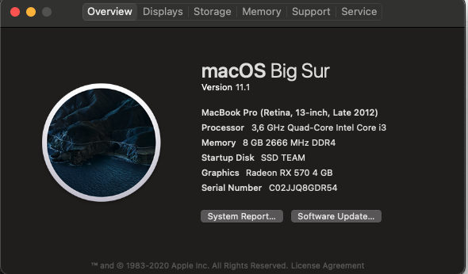

# Hackintosh-EFI-Comet-Lake

*EFI For Intel Generation 10*

<p align="center">
  
</p>

- My Spec : 

```
PROCESSOR	INTEL I3-10100F
VGA	XFX RX 570 4GB
RAM	KLEVV BOLT X 2x4GB 3200Mhz
MOBO	GIGABYTE H410M S2H
PSU	DEEPCOOL DE-530 - 400w
HDD	WD Blue 1TB 7200rpm
SSD	KINGMAX 128GB + Team Elite 120GB
```

- Boot with OpenCore and Documentation
	- https://dortania.github.io/OpenCore-Install-Guide/
- Setting Bios GIGABYTE H410M S2H
	- https://www.youtube.com/watch?v=l-MAeQXrUlg
- Tutorial with Video
	- https://www.youtube.com/watch?v=zdcPPpd-g8I

* EFI using OpenCore 0.6.6
